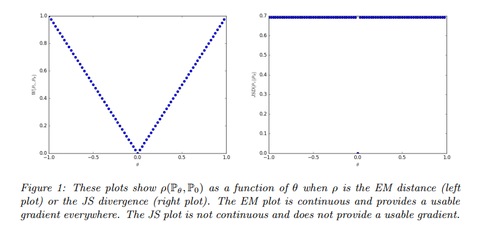
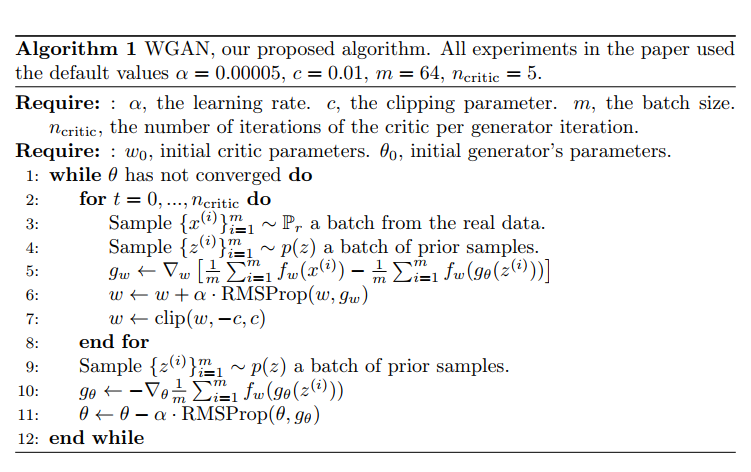

**2018-08-02**

# Training of GANs(Theoritical)

[1] 《Towards Principled Methods for Training Generative Adversarial Networks》

Martin Arjovsky, Léon Bottou

Abstract: The goal of this paper is not to introduce a single algorithm or method, but to make theoretical steps towards fully understanding the training dynamics of generative adversarial networks. In order to substantiate our theoretical analysis, we perform targeted experiments to verify our assumptions, illustrate our claims, and quantify the phenomena. This paper is divided into three sections. The first section introduces the problem at hand. The second section is dedicated to studying and proving rigorously the problems including instability and saturation that arize when training generative adversarial networks. The third section examines a practical and theoretically grounded direction towards solving these problems, while introducing new tools to study them.

My thoughts: 

1.  In original GAN, if we have a approximately optimal discriminator, then our training process will face gradiant vanish problem since optimizing the optimal generator is similar as optimizing the JS-divergence between Pr and Pg. This optimizing process will only be successful when Pr and Pg are highly overlapping, however in most cases they are not in a high dimension which is mapped from a lower dimention via neural networks. 

2.  The "-log(D) trick": the optimizing process for optimal generator can be seen as KL(Pg||Pr) - 2JS(Pr||Pg). This also rises a new problem: the KL divergence is not symmetric, so the contribution of KL will be 0 if Pg -> 0 and Pr -> 1 while KL will be infinity if Pg -> 1 and Pr -> 0. This loss will bring the result which is known as collapse mode(Generating many similar samples which can fool the discriminator, but loss the diversity).

3.  Based on the second trick, this paper proposes a new way to drag the distribution Pr and Pg closer: by adding noise into generated images and the real images. In this way the overlapping of Pr and Pg in higher dimension space is increased and the gradiant vanish problem can be solved. However, the adding noise will decrease in a certain rate(simulated annealing), so the JS divergence between (P_g+epsilon_g) and (P_r+epsilon_r) can't refelect the real JS divergence. This trick is still not perfect.

Paper: https://arxiv.org/pdf/1701.04862.pdf

# Training of GANs(Theoritical)

[2] 《Wasserstein GAN》

Martin Arjovsky, Soumith Chintala, L´eon Bottou

This paper introduces the Earth-Mover distance measure which is smooth and can generate meaningful gradients for GAN's training. Since it's hard to compute the lower bound of EM distance they use an alternate formulation to calculate the distance.(Prove and transformation is in the paper's appendix). This paper uses a simple two lines example to illustrate the EM distance.

The whole WGAN training procedure can be described as follows:

Detail review fron zhihu: https://zhuanlan.zhihu.com/p/25071913

Paper: https://arxiv.org/pdf/1701.07875.pdf

