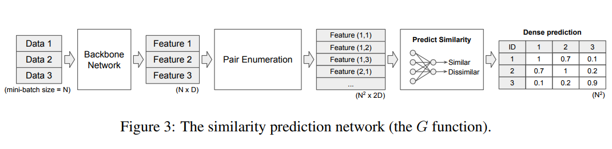
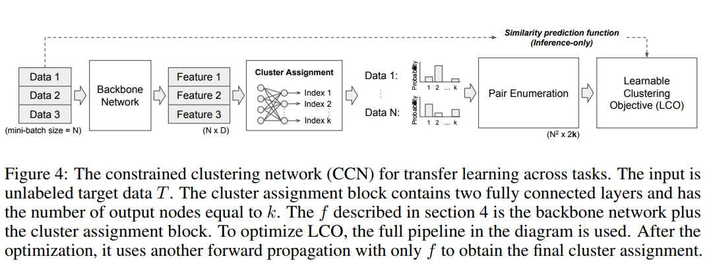

**2018-08-06**

# A learnable clustering objective to facilitate transfer learning across domains and tasks)

[1] 《Learning to Cluster in Order to Transfer Across Domains and Tasks》

Yen-Chang Hsu, Zhaoyang Lv, Zsolt Kira

Abstract: This paper introduces a novel method to perform transfer learning across domains and tasks, formulating it as a problem of learning to cluster. The key insight is that, in addition to features, we can transfer similarity information and this is sufficient to learn a similarity function and clustering network to perform both domain adaptation and cross-task transfer learning. We begin by reducing categorical information to pairwise constraints, which only considers whether two instances belong to the same class or not (pairwise semantic similarity). This similarity is category-agnostic and can be learned from data in the source domain using a similarity network. We then present two novel approaches for performing transfer learning using this similarity function. First, for unsupervised domain adaptation, we design a new loss function to regularize classification with a constrained clustering loss, hence learning a clustering network with the transferred similarity metric generating the training inputs. Second, for cross-task learning (i.e., unsupervised clustering with unseen categories), we propose a framework to reconstruct and estimate the number of semantic clusters, again using the clustering network. Since the similarity network is noisy, the key is to use a robust clustering algorithm, and we show that our formulation is more robust than the alternative constrained and unconstrained clustering approaches. Using this method, we first show state of the art results for the challenging cross-task problem, applied on Omniglot and ImageNet. Our results show that we can reconstruct semantic clusters with high accuracy. We then evaluate the performance of cross-domain transfer using images from the Office-31 and SVHN-MNIST tasks and present top accuracy on both datasets. Our approach doesn’t explicitly deal with domain discrepancy. If we combine with a domain adaptation loss, it shows further improvement.

Transfer across tasks: transfrom a labeled target learning task into a fixed learning task(similar, dissimilar). Learn a pairwise similarity prediction function G(x_i, x_j) = y_i,j. (Learning a neural network to generate pairwise constraints for target domain).

Transfer across domains: the labeled datasets A is ImageNet and S is one domain in the Office-31 dataset. The unlabeled T is
another domain in Office-31. The goal is to enhance classification performance on T by utilizing A, S, and T together.

The learnable clustering objectives: with the (noisy) network which can generate similarity predictions. We need an objective function to ultilize these learned pairwise results to learn a good generator for category prediction. LCO: relating the KL divergence between predicted categories with the pairwise constraints.

Network structure:

Open Reviews(cited from https://openreview.net/forum?id=ByRWCqvT-): 

Pros: This is a great paper 
- I enjoyed reading it. The authors lay down a general method for addressing various transfer learning problems: transferring across domains and tasks and in a unsupervised fashion. The paper is clearly written and easy to understand. Even though the method combines the previous general learning frameworks, the proposed algorithm for  LEARNABLE CLUSTERING OBJECTIVE (LCO) is novel, and fits very well in this framework.  Experimental evaluation is performed on several benchmark datasets - the proposed approach outperforms state-of-the-art for specific tasks in most cases. 

cons/suggestions: 
- the authors should discuss in more detail the limitations of their approach: it is clear that when there is a high discrepancy between source and target domains, that the similarity prediction network can fail. How to deal with these cases, or better, how to detect these before deploying this method?
- the pair-wise similarity prediction network can become very dense: how to deal with extreme cases?

Paper: https://arxiv.org/abs/1711.10125

