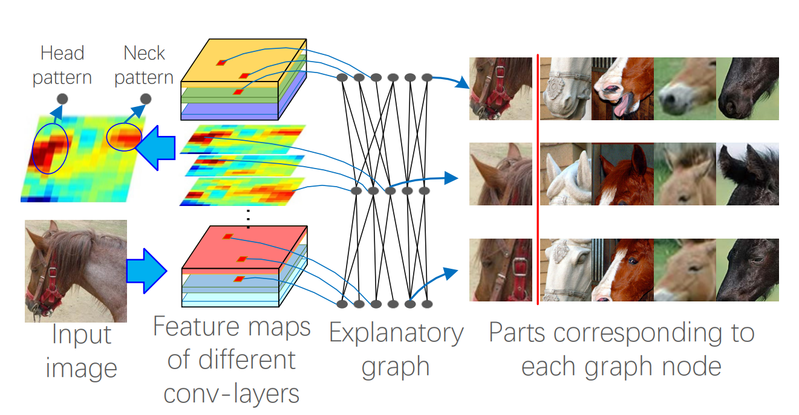
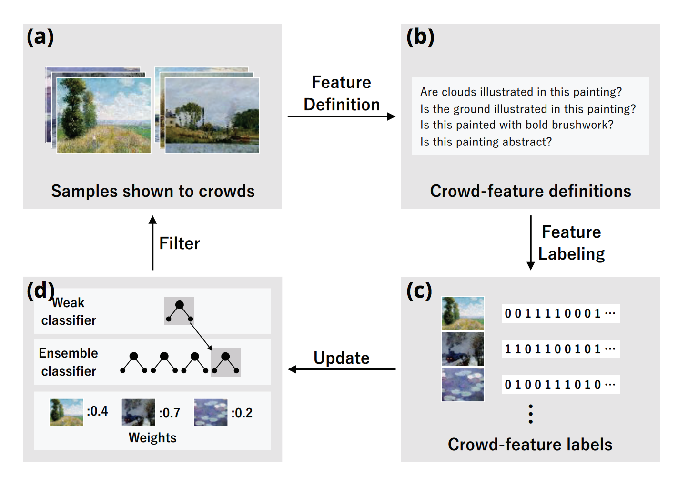

**2018-07-21**

# Interpretable Deep Learning

[1] 《Interpreting CNN Knowledge via an Explanatory Graph》

AAAI 2018 Quanshi Zhang, Ruiming Cao, Feng Shi, Ying Nian Wu, Song-Chun Zhu

Abstract: This paper learns a graphical model, namely an explanatory graph, which reveals the knowledge hierarchy hidden inside a pre-trained CNN. Considering that each filter in a conv-layer of a pre-trained CNN usually represents a mixture of object parts, we propose a simple yet efficient method to automatically disentangles different part patterns from each filter, and construct an explanatory graph. In the explanatory graph, each node represents a part pattern, and each edge encodes co-activation relationships and spatial relationships between patterns. More importantly, we learn the explanatory graph for a pre-trained CNN in an unsupervised manner, i.e., without a need of annotating object parts. Experiments show that each graph node consistently represents the same object part through different images. We transfer part patterns in the explanatory graph to the task of part localization, and our method significantly outperforms other approaches.

Introduction of an explanatory graph:

1. The explanatory graph has multiple layers. Each layer corresponds to a conv-layer in the CNN.
2. Each node in the explanatory graph represents a specific part pattern. We disentangle object-part components from features of each filter. Thus, we may learn multiple nodes from a single filter.
3. Each edge in the explanatory graph models the co-activation relationship and the deformable spatial relationship between nodes.
4. A node in a high layer represents a large part, while its connected nodes in the lower layer describe sub-regions of the part.
5. We can consider the explanatory graph as compression of middle-layer features in a CNN. We use thousands of graph nodes to represent information encoded in millions of neural units in middle conv-layers. Given an input image, its feature maps of conv-layers can only trigger a limited number of graph nodes.

Paper: https://arxiv.org/abs/1708.01785

Code: https://github.com/zqs1022/explanatoryGraph

# Human-in-the-loop Learning

[2] 《AdaFlock: Adaptive Feature Discovery for Human-in-the-Loop Predictive Modeling》

AAAI 2018 Ryusuke Takahama, Yukino Baba, Nobuyuki Shimizu, Sumio Fujita, Hisashi Kashima

Abstract: Feature engineering is the key to successful application of machine learning algorithms to real-world data. The discovery of informative features often requires domain knowledge or human inspiration, and data scientists expend a certain amount of effort into exploring feature spaces. Crowdsourcing is considered a promising approach for allowing many people to be involved in feature engineering; however, there is a demand for a sophisticated strategy that enables us to acquire good features at a reasonable crowdsourcing cost. In this paper, we present a novel algorithm called AdaFlock to efficiently obtain informative features through crowdsourcing. AdaFlock is inspired by AdaBoost, which iteratively trains classifiers by increasing the weights of samples misclassified by previous classifiers. AdaFlock iteratively generates informative features; at each iteration of AdaFlock, crowdsourcing workers are shown samples selected according to the classification errors of the current classifiers and are asked to generate new features that are helpful for correctly classifying the given examples. The results of our experiments conducted using real datasets indicate that AdaFlock successfully discovers informative features with fewer iterations and achieves high classification accuracy.

The figure below is the overview of AdaFlock, which iteratively generates informative features by asking crowdsourcing workers to provide features that are helpful for correctly classifying the misclassified examples.

Conlusion: In this paper, they proposed AdaFlock, an algorithm for generating informative features through crowdsourcing. AdaFlock iteratively obtains helpful features for improving the classification performance. Inspired by AdaBoost, at each iteration of AdaFlock, crowdsourcing workers are shown examples selected according to the classification errors of previous classifiers. They are then asked to generate features useful for correctly classifying the given examples. They apply the FilterBoost approach to sample the examples based on the classification errors. They conducted experiments on a commercial crowdsourcing platform, and the results indicate that AdaFlock successfully discovers informative and interpretable features.

My thoughts: It's pretty interesting to introduce human to define features and annotate features during the learning process. This framework is pretty similar with adaboost, and the results in the paper are reasonable. My only concern about this algorithm is: If the learned model contains lot's of human defined features, I'm wondering in the testing stage should we let human annotate all these features for the test set? This work may be huge if we apply this model to a large scale data set. 

Paper: https://www.aaai.org/ocs/index.php/AAAI/AAAI18/paper/view/16604

