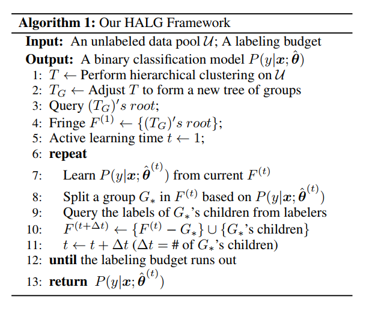
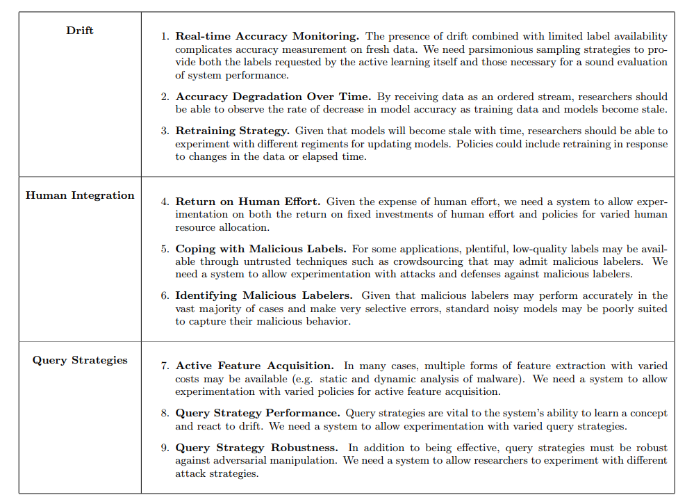

**2018-07-22**

# Active Learning

[1] 《Hierarchical Active Learning with Group Proportion Feedback》

IJCAI-2018 Zhipeng Luo and Milos Hauskrecht

Abstract: Learning of classification models in practice often relies on nontrivial human annotation effort in which humans assign class labels to data instances. As this process can be very time consuming and costly, finding effective ways to reduce the annotation cost becomes critical for building such models. In this work we solve this problem by exploring a new approach that actively learns classification models from groups, which are subpopulations of instances, and human feedback on the groups. Each group is labeled with a number in [0,1] interval representing a human estimate of the proportion of instances with one of the class labels in this subpopulation. To form the groups to be annotated, we develop a hierarchical active learning framework that divides the whole population into smaller subpopulations, which allows us to gradually learn more refined models from the subpopulations and their class proportion labels. Our extensive experiments on numerous data sets show that our method is competitive and outperforms existing approaches for reducing the human annotation cost.

Related works: Cluster-Based Active Learning, Active Learning from Group Feedback(Learning setting: annotators prefer to work with group-level queries which are shorter, less confusing and more intuitive), Learning from Group Proportion Feedback.

Framework:

My thoughts: This paper use hierarchical clustering method and alternate methods to derive hypercube-like groups of data(they wish the hypercube-like group has high purity and representative). Instead of labeling each instance in traditional active learning query setting, this algorithm takes group proportional label and assign the exact label for each instance within the group based on model's confidence. Moreover, this paper uses maximal expected model change strategy to select group of instances to query. They demonstrate from experiments that this strategy can bring fast convergence and select informative instances within these groups. I'd like to see more detail in experiments parts, like what classifier they choose, what kind of hierarchical clustering method is used. Since this is a tree shape(top-down) learning method, maybe it's better to illustrate the learning process in a flowing graph.  

Paper: https://www.ijcai.org/proceedings/2018/351

# Active Learning

[2] 《Adversarial Active Learning》

Miller, Brad, et al. "Adversarial active learning." Proceedings of the 2014 Workshop on Artificial Intelligent and Security Workshop. ACM, 2014.

Abstract: Active learning is an area of machine learning examining strategies for allocation of finite resources, particularly human labeling efforts and to an extent feature extraction, in situations where available data exceeds available resources. In this open problem paper, we motivate the necessity of active learning in the security domain, identify problems caused by the application of present active learning techniques in adversarial settings, and propose a framework for experimentation and implementation of active learning systems in adversarial contexts. More than other contexts, adversarial contexts particularly need active learning as ongoing attempts to evade and confuse classifiers necessitate constant generation of labels for new content to keep pace with adversarial activity. Just as traditional machine learning algorithms are vulnerable to adversarial manipulation, we discuss assumptions specific to active learning that introduce additional vulnerabilities, as well as present vulnerabilities that are amplified in the active learning setting. Lastly, we present a software architecture, Security-oriented Active Learning Testbed (SALT), for the research and implementation of active learning applications in adversarial contexts.

Specific experimental topics relating to active learning for security applications and in adversarial contexts:

My thoughts: It's good to consider the human's role in active learning problems. Human annotations can be noisy or even malicious. Since most active learning algorithms have a query strategy/heuristic, the attacker can make use of this strategy to inject malicous instances. I like the future directions concluded in the figure, especially developing robust active learning methods, I think a robust active learning method should have three aspects: 1. Good interpretation of the current query. 2. Model can detect malicious feedback or mitigate the negative influence of the noisy labeling. 3. Good performance(minimizing the total querying costs).  

Paper: https://dl.acm.org/citation.cfm?id=2666656

# Clustering

[3] 《Descriptive Clustering: ILP and CP Formulations with Applications》

Kuo, Chia-Tung, et al. "Descriptive Clustering: ILP and CP Formulations with Applications." IJCAI-ECAI 2018, the 27th International Joint Conference on Artificial Intelligence and the 23rd European Conference on Artificial Intelligence. 2018.

Abstract: In many settings just finding a good clustering is insufficient and an explanation of the clustering is required. If the features used to perform the clustering are interpretable then methods such as conceptual clustering can be used. However, in many applications this is not the case particularly for image, graph and other complex data. Here we explore the setting where a set of interpretable discrete tags for each instance is available. We formulate the descriptive clustering problem as a bi-objective optimization to simultaneously find compact clusters using the features and to describe them using the tags. We present our formulation in a declarative platform and show it can be integrated into a standard iterative algorithm to find all Pareto optimal solutions to the two objectives. Preliminary results demonstrate the utility of our approach on real data sets for images and electronic health care records and that it outperforms single objective and multiview clustering baselines.

Paper major ideas: this paper wants to minimizes the compactness of the clusters and maximize the descriptiveness at the same time. They introduce a tag attribute for each instance and formulize the previous goal into a ILP problem and CP problem. Since these is a trade-off between minimizing compactness and maximizing the descriptibess(more common tags), this paper propose an iterative algorithm to find the pareto optimal frontier which contains clustering results that are pareto optimal. Through experiments results in animals data set, I can see many tags have been correctely labeled for each category, and the animal within each category satisfy the compactness. Since this is a new problem setting so we don't see any comparing experiments, but I'm wondering can we put the tags of each instance as a feature and do a clustering for all these instances? In this way the instances within the same cluster will also share compactness and common tags.

Paper: https://www.ijcai.org/proceedings/2018/176

