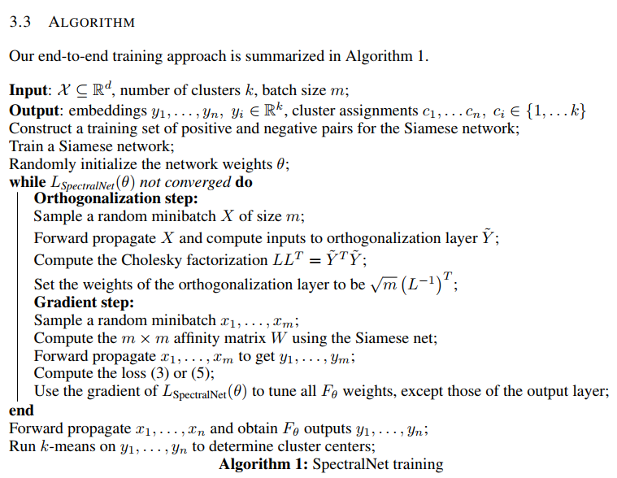

**2018-07-23**

# Generative Networks

[1] 《Latent Constraints: Learning to Generate Conditionally from Unconditional Generative Models》

Jesse Engel, Matthew Hoffman, Adam Roberts

Abstract: Deep generative neural networks have proven effective at both conditional and unconditional modeling of complex data distributions. Conditional generation enables interactive control, but creating new controls often requires expensive retraining. In this paper, we develop a method to condition generation without retraining the model. By post-hoc learning latent constraints, value functions identify regions in latent space that generate outputs with desired attributes, we can conditionally sample from these regions with gradient-based optimization or amortized actor functions. Combining attribute constraints with a universal “realism” constraint, which enforces similarity to the data distribution, we generate realistic conditional images from an unconditional variational autoencoder. Further, using gradient-based optimization, we demonstrate identity-preserving transformations that make the minimal adjustment in latent space to modify the attributes of an image. Finally, with discrete sequences of musical notes, we demonstrate zero-shot conditional generation, learning latent constraints in the absence of labeled data or a differentiable reward function.

Paper: https://arxiv.org/abs/1711.05772

# Unsupervised Spectral Clustering using Deep Neural Networks

[2] 《SpectralNet: Spectral Clustering using Deep Neural Networks》

Uri Shaham, Kelly Stanton, Henry Li, Ronen Basri, Boaz Nadler, Yuval Kluger

Abstract: Spectral clustering is a leading and popular technique in unsupervised data analysis.  Two of its major limitations are scalability and generalization of the spectral embedding (i.e., out-of-sample-extension). In this paper we introduce a deep learning approach to spectral clustering that overcomes the above shortcomings. Our network, which we call SpectralNet, learns a map that embeds input data points into the eigenspace of their associated graph Laplacian matrix and subsequently clusters them. We train SpectralNet using a procedure that involves constrained stochastic optimization. Stochastic optimization allows it to scale to large datasets, while the constraints, which are implemented using a special purpose output layer, allow us to keep the network output orthogonal. Moreover, the map learned by SpectralNet naturally generalizes the spectral embedding to unseen data points. To further improve the quality of the clustering, we replace the standard pairwise Gaussian affinities with affinities leaned from unlabeled data using a Siamese network.  Additional improvement can be achieved by applying the network to code representations produced, e.g., by standard autoencoders. Our end-to-end learning procedure is fully unsupervised. In addition, we apply VC dimension theory to derive a lower bound on the size of  SpectralNet.  State-of-the-art clustering results are reported for both the MNIST and Reuters datasets.

One good review from Openreview:

The paper introduces a deep learning based approach that approximates spectral clustering. The basic idea is to train a neural network to map a representation of input in the eigenspace where k-means clustering can be performed as usual. The method is more scalable than the vanilla spectral clustering algorithm and it can also be used to cluster a new incoming data point without redoing the whole spectral clustering procedure. The authors have proved worst case lower bounds on the size of neural network required to perform the task using VC dimension theory. Experiments on MNIST and Reuters dataset show state of the art performance (On Reuter's there is a significant performance improvement under one measure).

Main Contributions:

1. Introduced SpectralNet - a neural network that maps input points to their embeddings in the eigenspace
Used constraint optimization (using Cholesky decomposition) to train the final layer of neural network to make sure that the output "eigenvectors" are orthonormal.
2. Solves the problem of scalability by using stochastic optimization (basically using mini-batches to train neural network).
3. Solves the problem of generalization to new data points as the neural network can be used to directly compute the embedding for the incoming data point in the eigenspace.
4. Proved a lower bound for VC dimension of spectral clustering (linear in n as opposed to linear in input dimension d for k-means, which explains the expressive power of spectral clustering).
5. Derived a worst-case lower bound for the size of neural network that is needed to realize the given objective.
6. Experimented by using Gaussian kernel similarity and similarity learned using a Siamese neural network (trained in an unsupervised way) on both input space and code space (auto-encoder representation).

Overall:

1. The paper is very clearly written. The idea is simple yet clever. Incorporating the ortho-normalization constraint in the final layer of the neural network is interesting.
2. The VC dimension based result are interesting but useless as the authors themselves argue that in practical cases the size of neural network required will be much less than the worst case lower bound proved in the paper.
3. The experiments demonstrate the effectiveness of the proposed approach.
4. The unsupervised training of Siamese is based on code k-nearest neighbor approach to get positive and negative examples. It is not clear why the learned matrix should outperform Gaussian kernel, but the experiments show that it does.

