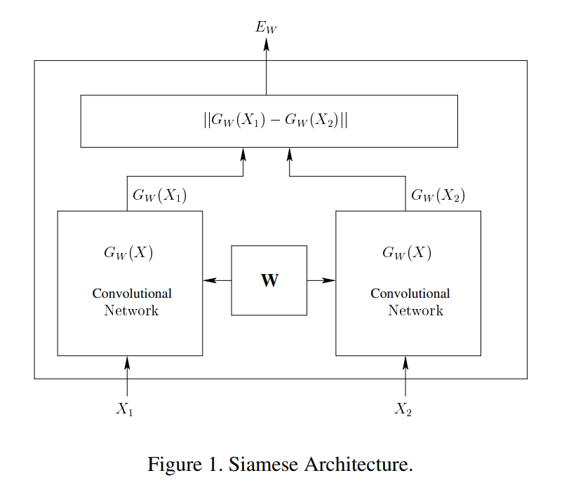

**2018-07-24**

# Siamese Network

[1] 《Learning a similarity metric discriminatively, with application to face verification》

Sumit Chopra, Raia Hadsell, Yann LeCun

Abstract: We present a method for training a similarity metric from data. The method can be used for recognition or verification applications where the number of categories is very large and not known during training, and where the number of training samples for a single category is very small. The idea is to learn a function that maps input patterns into a target space such that the norm in the target space approximates the “semantic” distance in the input space. The method is applied to a face verification task. The learning process minimizes a discriminative loss function that drives the similarity metric to be small for pairs of faces from the same person, and large for pairs from different persons. The mapping from raw to the target space is a convolutional network whose architecture is designed for robustness to geometric distortions. The system is tested on the Purdue/AR face database which has a very high degree of variability in the pose, lighting, expression, position, and artificial occlusions such as dark glasses and obscuring scarves.

Network Structure:

Conclusion:

We present a general discriminative method for learning complex similarity metrics. The method is best suited for classification or verification scenarios where the number of classes is very large, and/or where examples of all the classes are not available at the time of training. We illustrate the method with a face verification application.

Paper: https://ieeexplore.ieee.org/stamp/stamp.jsp?tp=&arnumber=1467314
Code:  https://github.com/Shicoder/DeepLearning_Demo/tree/master/siamese_tf_mnist

