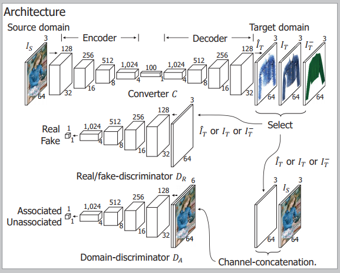

**2018-07-28**

# Supervised image-to-image translation

[1] 《Pixel-Level Domain Transfer》

Donggeun Yoo, Namil Kim, Sunggyun Park, Anthony S. Paek, In So Kweon

Abstract: We present an image-conditional image generation model. The model transfers an input domain to a target domain in semantic level, and generates the target image in pixel level. To generate realistic target images, we employ the real/fake-discriminator as in Generative Adversarial Nets, but also introduce a novel domain-discriminator to make the generated image relevant to the input image. We verify our model through a challenging task of generating a piece of clothing from an input image of a dressed person. We present a high quality clothing dataset containing the two domains, and succeed in demonstrating decent results.

Network structure:

Contributions In summary, our contributions are,
1. Proposing the first framework for semantically transferring a source domain to a target domain in pixel-level.
2. Proposing a novel discriminator that enables us to train the semantic relation between the domains.
3. Building a large clothing dataset containing two domains, which is expected to contribute to a wide range of domain adaptation researches.
