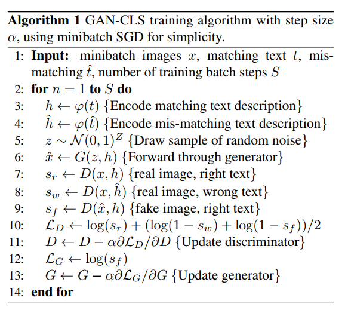

**2018-07-31**

# Generative Adversarial Text-to-Image Synthesis

[1] 《Generative Adversarial Text to Image Synthesis》

Scott Reed, Zeynep Akata, Xinchen Yan, Lajanugen Logeswaran, Bernt Schiele, Honglak Lee

Abstract: Automatic synthesis of realistic images from text would be interesting and useful, but current AI systems are still far from this goal. However, in recent years generic and powerful recurrent neural network architectures have been developed to learn discriminative text feature representations. Meanwhile, deep convolutional generative adversarial networks (GANs) have begun to generate highly compelling images of specific categories, such as faces, album covers, and room interiors. In this work, we develop a novel deep architecture and GAN formulation to effectively bridge these advances in text and image modeling, translating visual concepts from characters to pixels. We demonstrate the capability of our model to generate plausible images of birds and flowers from detailed text descriptions.

Network Structure:

GAN-CLS Training Algorithm: 

My thoughts: This is the first work which uses GAN to generate images from texts. With deep neural networks we can generate text embeddings and also use these features to generate images. Although in real world one sentence can map to different images from different domains, here this work is focused on some simple image data sets. The network structure is simple and straightforward. By concatenating the text features into the Gaussian noise as the input for the generator, the discriminator takes both original text sentences and unrelated text sentences to help improve the learning process. Moreover this work uses manifold interpolation to fill the gap of input text data, making the model achieves better results on CUB. Since the text features are appended into the input of the generator, the Gaussian noise z can be treated as style and background latent variable. Given a learnt GAN and new query image they can train a style encoder to learn the style latent variable and do style transfer via the learnt GAN. The experiments results demonstrate the successful translation, however when the text description include location information this method will fail. This might be an interesting direction to research in the future. 

Paper: https://arxiv.org/pdf/1605.05396.pdf

